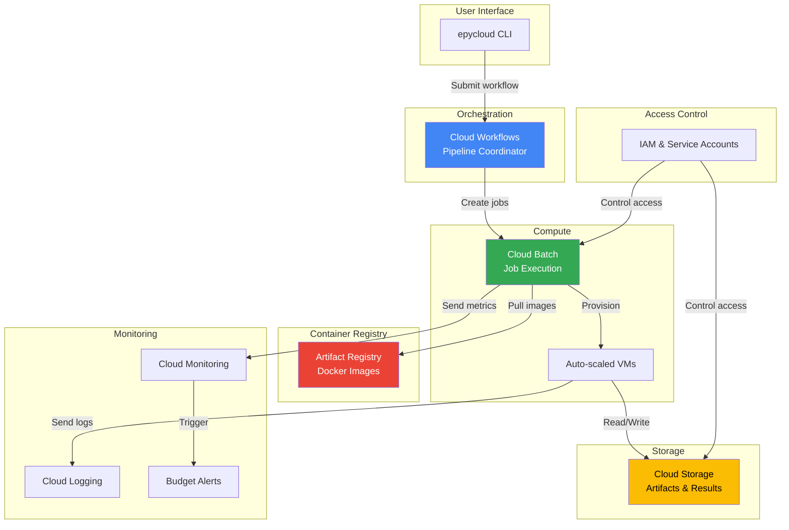

# Cloud Infrastructure

## Infrastructure overview

The pipeline is built as a **serverless architecture** on Google Cloud. There are no persistent servers or clusters to manage. Cloud Batch provisions VMs on demand for each job and terminates them after completion, so you only pay for the compute you use. All infrastructure is defined as code using Terraform.



## Terraform

**Infrastructure as Code**

All infrastructure is defined in the [`terraform/`](https://github.com/mobs-lab/epymodelingsuite-cloud/tree/main/terraform) directory. This includes Artifact Registry, Cloud Workflows, service accounts, IAM bindings, networking, and monitoring alerts. The GCS bucket is created manually outside of Terraform (see [Prerequisites](../getting-started/cloud-deployment/prerequisites.md/#gcs-bucket-optional)).

**Managed through epycloud**

Instead of running `terraform` directly, you use `epycloud terraform` commands. Under the hood, `epycloud` reads your [configuration](../user-guide/configuration/index.md) and converts values like project ID, region, and resource allocations into `TF_VAR_*` environment variables. This way, Terraform always uses the same settings as the rest of `epycloud` without you needing to pass `-var` flags manually.

**Remote state**

State is stored remotely in a GCS backend (configured in `main.tf`) for safe collaboration.

```
terraform/
├── main.tf          # APIs, storage, registry, workflows, secrets
├── variables.tf     # Input variables
├── outputs.tf       # Output values
├── network.tf       # VPC, subnet, NAT, firewall
└── monitoring.tf    # Budget and alert policies
```

To deploy or update infrastructure, see [Cloud Deployment: Deploy Infrastructure](../getting-started/cloud-deployment/setup.md#step-3-deploy-infrastructure).


## Core services

### Cloud Storage (GCS)

Persistent storage for all pipeline artifacts and results. Stores builder inputs, runner results, and final outputs under a structured path hierarchy (`{bucket}/{dir_prefix}{exp_id}/{run_id}/...`). Optional lifecycle policies handle automatic cleanup of old artifacts.

<!-- 
link-card: https://docs.cloud.google.com/storage/docs
    | title="Cloud Storage documentation | Google Cloud"
    | description=false
-->

### Artifact Registry

Docker image repository for pipeline containers. Stores both `local` and `cloud` image variants in a regional repository for fast pulls during job execution. Cloud Build pushes images here automatically; Cloud Batch pulls them when starting jobs.

<!-- 
link-card: https://docs.cloud.google.com/artifact-registry/docs
    | title="Artifact Registry documentation | Google Cloud"
    | description=false
-->

### Cloud Build

Builds Docker images and pushes them to Artifact Registry. Submitted asynchronously via `epycloud build cloud`. See [Cloud Build configuration](#cloud-build) below for implementation details.

<!--
link-card: https://docs.cloud.google.com/build/docs
    | title="Cloud Build documentation | Google Cloud"
    | description=false
-->

### Cloud Batch

Serverless compute for running pipeline stages. Cloud Workflows submits job definitions, Cloud Batch provisions VMs based on resource requirements, VMs pull Docker images from Artifact Registry, containers execute pipeline scripts, and VMs are automatically terminated after completion. No cluster management required.

<!-- 
link-card: https://docs.cloud.google.com/batch/docs
    | title="Batch documentation | Compute Engine | Google Cloud"
    | description=false
-->

### Cloud Workflows

Orchestrates multi-stage pipeline execution. Coordinates the sequential execution of Stage A → B → C, handles job status polling, passes data between stages (e.g., `NUM_TASKS`), and manages conditional execution (optional Stage C). See **[Workflows Orchestration](workflows-orchestration.md)** for design details.

<!-- 
link-card: https://docs.cloud.google.com/workflows/docs
    | title="Workflows documentation | Google Cloud"
    | description=false
-->

### Cloud Logging

Centralized log aggregation from Cloud Workflows executions, Cloud Batch jobs, and container stdout/stderr. Logs are labeled with `exp_id`, `run_id`, `stage`, and `task_index` for filtering. Default retention is 30 days.

<!-- 
link-card: https://docs.cloud.google.com/logging/docs
    | title="Cloud Logging documentation | Google Cloud"
    | description=false
-->

### Cloud Monitoring

Tracks infrastructure metrics and triggers alerts for workflow execution failures, batch job failures (>10% failure rate), and budget threshold crossings (50%, 80%, 100% of monthly budget).

<!-- 
link-card: https://docs.cloud.google.com/monitoring/docs
    | title="Cloud Monitoring documentation | Google Cloud"
    | description=false
-->


## Cloud Build configurations

The build is configured in [`cloudbuild.yaml`](https://github.com/mobs-lab/epymodelingsuite-cloud/blob/main/cloudbuild.yaml):

- Uses `E2_HIGHCPU_8` machine type for faster builds. See [this page](https://cloud.google.com/build/pricing) for available instance types.
- Supports layer caching with `--cache-from` and `BUILDKIT_INLINE_CACHE` (optional, controlled by `_NO_CACHE` flag)
- Fetches `GITHUB_PAT` from Secret Manager for private repository access during build
- Runs [container structure tests](docker-images.md#container-structure-tests) after build to validate the image

## Cloud Batch resources

Default resource allocations per stage (from [`terraform/variables.tf`](https://github.com/mobs-lab/epymodelingsuite-cloud/blob/main/terraform/variables.tf)):

| Stage | CPU | Memory | Timeout | Machine Type | Parallelism |
|-------|-----|--------|---------|--------------|-------------|
| A (Builder) | 2000 milli | 8192 MiB | 3600s (1 hr) | `c4d-standard-2` | 1 task |
| B (Runner) | 2000 milli | 4096 MiB | 36000s (10 hr) | auto-selected | up to 100 tasks |
| C (Output) | 4000 milli | 15360 MiB | 7200s (2 hr) | `c4d-standard-4` | 1 task |

All values can be overridden from your [epycloud configuration](../user-guide/configuration/index.md) under `google_cloud.batch`. When no machine type is specified (empty string), Cloud Batch auto-selects a VM type based on the CPU and memory requirements. See [Google Cloud Batch documentation](https://cloud.google.com/batch/docs/create-run-job#resources) for details on resource configuration.

Note: CPU is measured in millicores (1000 milli = 1 vCPU).

## IAM & Service accounts

Two service accounts are created with minimal permissions:

**Workflow Service Account** (used by Cloud Workflows):

| Role | Purpose |
|------|---------|
| `roles/batch.jobsEditor` | Create and manage Batch jobs |
| `roles/logging.logWriter` | Write workflow logs |

**Batch Service Account** (used by Cloud Batch VMs):

| Role | Purpose |
|------|---------|
| `roles/storage.objectAdmin` | Read/write GCS artifacts |
| `roles/artifactregistry.reader` | Pull Docker images |
| `roles/logging.logWriter` | Write job logs |

## Required Google Cloud APIs

The following APIs must be enabled (Terraform handles this automatically):

- `batch.googleapis.com` - Cloud Batch
- `workflows.googleapis.com` - Cloud Workflows
- `storage.googleapis.com` - Cloud Storage
- `artifactregistry.googleapis.com` - Artifact Registry
- `cloudbuild.googleapis.com` - Cloud Build
- `logging.googleapis.com` - Cloud Logging
- `monitoring.googleapis.com` - Cloud Monitoring


## Next steps

- **[Cloud Deployment](../getting-started/cloud-deployment/index.md)**: Setup and deployment guide
- **[Workflows Orchestration](workflows-orchestration.md)**: Workflow design details
- **[Pipeline Stages](pipeline-stages.md)**: How stages run on this infrastructure
