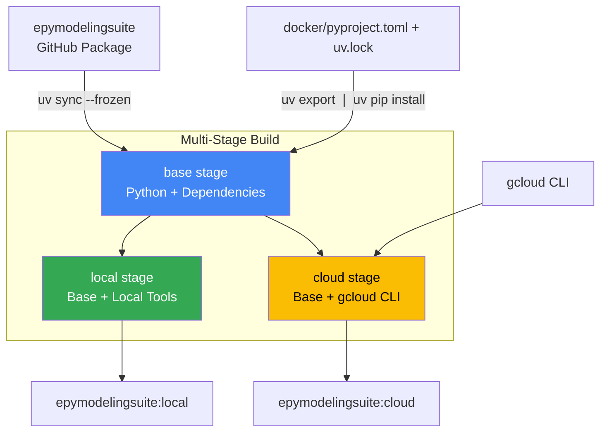

# Docker Images

All pipeline stages run inside Docker containers built from a multi-stage [Dockerfile](https://github.com/mobs-lab/epymodelingsuite-cloud/blob/main/docker/Dockerfile). This ensures consistent, reproducible environments across development, testing, and production.

## Why Docker?

Docker **packages everything the pipeline needs** (Python, `epymodelingsuite`, and all dependencies) into a single image that can **run anywhere**: your laptop, a cloud VM, or CI/CD.

There are two image variants (`local` and `cloud`) that **share the same base** with all pipeline dependencies. The `local` variant is minimal for development with Docker Compose, while the `cloud` variant adds gcloud CLI for production runs on Google Cloud Batch.

<!-- link-card: https://www.docker.com/resources/what-container/
    | title="What is a Container? | Docker"
    | description=false
 -->

## Image architecture



The Dockerfile uses multi-stage builds to create two image variants:

- **local**: Minimal image for local development (no cloud tools)
- **cloud**: Full image with gcloud CLI for Google Cloud execution

Both variants share the same base dependencies and `epymodelingsuite` package.

## Build stages

### base

- Installs Python 3.11, system packages (git, curl), and the `uv` package manager
- Clones and installs `epymodelingsuite` from GitHub using `uv sync --frozen`
- Installs cloud-specific dependencies from `docker/pyproject.toml` + `docker/uv.lock` into the same virtual environment

### local

- Inherits from base
- Minimal image for local development and testing with Docker Compose

### cloud

- Inherits from base
- Adds gcloud CLI for Secret Manager access and Cloud Storage authentication
- Used for production runs on Google Cloud Batch

## Dependency installation

Dependencies are installed from two sources, both using locked versions:

### 1. epymodelingsuite

- Cloned from the [`mobs-lab/epymodelingsuite`](https://github.com/mobs-lab/epymodelingsuite) GitHub repo to `/opt/epymodelingsuite/`
- Installed via `uv sync --frozen`, which creates a virtual environment at `/opt/epymodelingsuite/.venv` using the repo's [`uv.lock`](https://github.com/mobs-lab/epymodelingsuite/blob/dev/uv.lock)
- Falls back to `uv sync` (unlocked) if `uv.lock` is not present

!!! note "Build arguments"
    The repository and branch/tag are configurable via Docker build arguments, which are populated from your [epycloud configuration](../user-guide/configuration/index.md):

    - `GITHUB_MODELING_SUITE_REPO`: GitHub repo (from `github.modeling_suite_repo`)
    - `GITHUB_MODELING_SUITE_REF`: Branch or commit (from `github.modeling_suite_ref`, default: `main`)
    - `GITHUB_PAT`: Personal access token (from `secrets.yaml`, only needed for private repos)

### 2. Cloud-specific dependencies

- Defined in this repo's `docker/pyproject.toml` (google-cloud-storage, dill, python-json-logger)
- Locked in [`docker/uv.lock`](https://github.com/mobs-lab/epymodelingsuite-cloud/blob/main/docker/uv.lock)
- Installed into the same venv via `uv export --frozen --no-dev | uv pip install --no-cache -r -`

This two-step approach is needed because `uv sync` is project-centric (creates its own `.venv`), while `uv pip install` respects the `VIRTUAL_ENV` environment variable, allowing cloud deps to be added to the existing epymodelingsuite venv.

## Pipeline scripts

All [pipeline scripts](https://github.com/mobs-lab/epymodelingsuite-cloud/tree/main/docker/scripts) are copied into the image at `/scripts/` during build:

```
/scripts/
├── run_dispatcher.sh        # Unified entrypoint (routes to stage scripts)
├── run_builder.sh           # Stage A wrapper (clones experiment repo)
├── run_runner.sh            # Stage B wrapper (downloads repo tarball or clones)
├── run_output.sh            # Stage C wrapper (optional repo clone)
├── main_builder.py          # Stage A main script
├── main_runner.py           # Stage B main script
├── main_output.py           # Stage C main script
└── util/
    ├── __init__.py
    ├── config.py            # Configuration utilities
    ├── error_handling.py    # Error handling utilities
    ├── logger.py            # Structured JSON logging
    └── storage.py           # Storage abstraction layer
```

**Entrypoint**: Both `local` and `cloud` images use `/scripts/run_dispatcher.sh` as the entrypoint. The dispatcher routes to the correct stage script based on the `STAGE` environment variable (`builder`/`A`, `runner`/`B`, or `output`/`C`).

## Container paths

These are the key directories inside the container. The first three are baked into the image at build time, while `/data/` paths are populated at runtime (mounted locally or accessed via GCS).

| Path | Purpose | Source |
|------|---------|--------|
| `/app/` | Working directory | Dockerfile WORKDIR |
| `/scripts/` | Pipeline scripts | Copied from `docker/scripts/` at build time |
| `/opt/epymodelingsuite/` | epymodelingsuite package + venv | Cloned from GitHub at build time |
| `/data/forecast/` | Experiment data (configs, common-data, functions) | Cloned from GitHub at runtime (cloud) or mounted from `./local/forecast/` (local) |
| `/data/bucket/` | Pipeline artifacts (inputs, results, outputs) | GCS via storage module (cloud) or mounted from `./local/bucket/` (local) |

## Environment variables

Containers receive environment variables at runtime that control their behavior. In cloud mode, these are set by the workflow when submitting Batch jobs. In local mode, they are set via Docker Compose or the `epycloud` CLI.

### All stages

| Variable | Description |
|----------|-------------|
| `EXECUTION_MODE` | `cloud` or `local`, determines storage backend and authentication |
| `EXP_ID` | Experiment identifier |
| `RUN_ID` | Run identifier (auto-generated in cloud, manual in local) |
| `LOG_LEVEL` | Logging level (default: `INFO`) |

### Cloud mode only

| Variable | Description |
|----------|-------------|
| `GCS_BUCKET` | GCS bucket name for artifact storage |
| `DIR_PREFIX` | Base directory prefix (e.g., `pipeline/flu/`) |
| `GITHUB_FORECAST_REPO` | Experiment data repo to clone (format: `owner/repo`) |
| `FORECAST_REPO_REF` | Branch/tag/commit for experiment repo |
| `GCLOUD_PROJECT_ID` | Google Cloud project ID |
| `GITHUB_PAT_SECRET` | Secret Manager secret name for GitHub PAT |
| `FORECAST_REPO_DIR` | Path to clone experiment repo into (default: `/data/forecast/`) |

### Stage-specific

| Variable | Stage | Description |
|----------|-------|-------------|
| `TASK_INDEX` | B | Task index for local mode (overrides `BATCH_TASK_INDEX`) |
| `BATCH_TASK_INDEX` | B | Task index set automatically by Cloud Batch |
| `NUM_TASKS` | C | Number of Stage B result files to load |
| `OUTPUT_CONFIG_FILE` | C | Output config filename (e.g., `output_projection.yaml`) |
| `ALLOW_PARTIAL_RESULTS` | C | Set to `true` to generate outputs when some Stage B tasks failed |
| `STORAGE_VERBOSE` | All | Enable verbose storage logging (default: `true` in local mode) |

## Container structure tests

Images are validated after build using [container-structure-test](https://github.com/GoogleContainerTools/container-structure-test), configured in [`docker/container-structure-test.yaml`](https://github.com/mobs-lab/epymodelingsuite-cloud/blob/main/docker/container-structure-test.yaml). These tests run automatically during Cloud Build and can also be run locally.

The tests verify:

- `epymodelingsuite` is importable
- Python executable comes from the uv-managed venv (`/opt/epymodelingsuite/.venv/`)
- Cloud dependencies are importable (google-cloud-storage, dill, python-json-logger)
- Entrypoint script (`run_dispatcher.sh`) exists and is executable

```console
$ docker run --rm \
    -v /var/run/docker.sock:/var/run/docker.sock \
    -v $(pwd)/docker/container-structure-test.yaml:/config.yaml \
    gcr.io/gcp-runtimes/container-structure-test:latest test \
    --image <image-name> --config /config.yaml
```

## Next steps

- **[Execution Modes](execution-modes.md)**: How `local` and `cloud` image variants are used in each mode
- **[Building Images](../user-guide/building-images/index.md)**: How to build and push Docker images
- **[Pipeline Stages](pipeline-stages.md)**: How images are used in each stage
- **[Cloud Infrastructure](cloud-infrastructure.md)**: Where images are deployed
- **[Storage Abstraction](storage-abstraction.md)**: How scripts inside images access data
