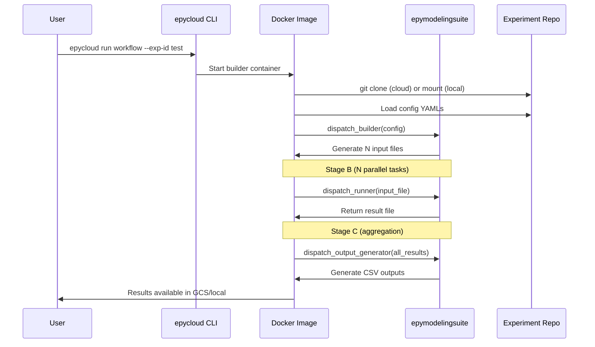

# Ecosystem Components

To support scalable epidemic modeling and research, the ecosystem is built on four independent repositories that can each evolve independently:

| Component | Role |
|---|---|
| **[epydemix](https://github.com/epistorm/epydemix)** | Epidemic modeling engine in Python with support for model calibration using Approximate Bayesian Computation |
| **[epymodelingsuite](https://github.com/mobs-lab/epymodelingsuite)** | YAML-configured modeling suite for routine epidemic forecasting with support for interventions like school closures and vaccines. Uses epydemix as engine. |
| **[epymodelingsuite-cloud](https://github.com/mobs-lab/epymodelingsuite-cloud)** | Cloud infrastructure and `epycloud` CLI for running parallel workloads on Google Cloud with local development support |
| **Experiment data repository** | YAML experiment configurations, shared surveillance data, and custom functions. Typically one per project (e.g. flu, COVID-19, RSV). |

## 1. epydemix (Engine)

<!-- link-card: https://github.com/epistorm/epydemix -->

General-purpose epidemic modeling engine that provides the core compartmental model framework.

**What It Provides**:

- **Compartmental Models**: Framework for building and simulating epidemic models (SIR, SEIR, etc.)
- **Calibration**: Model calibration using Approximate Bayesian Computation (ABC)
- **Data Integration**: Built-in support for population and mobility data

**How It's Used**: Installed as a dependency of epymodelingsuite.

## 2. epymodelingsuite (Modeling Suite)

<!-- link-card: https://github.com/mobs-lab/epymodelingsuite -->

YAML-configured modeling suite for routine epidemic forecasting with support for interventions like school closures and vaccines.

**What It Provides**:

- **Configuration System**: YAML-based experiment definitions with Pydantic validation
- **Model Building**: Builders for compartmental models, parameter sampling, scenario generation
- **Execution Engine**: Dispatcher for workload generation (`dispatch_builder`), simulation/calibration execution (`dispatch_runner`), and result aggregation (`dispatch_output_generator`)

**Key Dependencies**: `epydemix` (core modeling library), `pandas`, `numpy`, `scipy`, `pydantic`, `PyYAML`

**How It's Used**: Installed into the Docker image during build from the GitHub repository. The repository and branch/tag are configurable, allowing version pinning for reproducible runs.

## 3. epymodelingsuite-cloud (Infrastructure)

<!-- link-card: https://github.com/mobs-lab/epymodelingsuite-cloud/ -->

Provides serverless cloud infrastructure for running `epymodelingsuite` workflows at massive scale on Google Cloud. **This is the current repository.**

**What It Provides**:

- **epycloud CLI**: Command-line tool for managing the entire pipeline lifecycle (configuration, building, running, monitoring)
- **Docker Images**: Multi-stage Dockerfile packaging `epymodelingsuite`, all dependencies, and pipeline scripts
- **Pipeline Scripts**: Entry points for each stage (`main_builder.py`, `main_runner.py`, `main_output.py`) plus the storage abstraction layer
- **Infrastructure as Code**: Terraform modules for GCS, Artifact Registry, Cloud Workflows, Cloud Batch, IAM, and monitoring
- **Configuration Management**: Hierarchical config system with base config, secrets, environment overrides, and profile settings

## 4. Experiment Data Repository

Stores experiment configurations and input data separately from code, enabling version control of experiments and data sharing among researchers.

**What It Provides**:

- **Experiment Configurations**: YAML files defining modeling experiments (`basemodel.yaml`, `modelset.yaml`, `output.yaml`)
- **Common Data**: Shared datasets (surveillance data, population demographics, mobility data)
- **Custom Functions**: User-defined Python modules for experiment-specific modeling logic

**How It's Used**: In cloud mode, the builder stage clones the repository at runtime (using a GitHub PAT if the repository is private). In local mode, users copy experiment configurations to `./local/forecast/` which is mounted into containers.

## How Components Work Together

## Next Steps

- **[Pipeline Stages](pipeline-stages.md)**: How stages use these components
- **[Docker Images](docker-images.md)**: How components are packaged
- **[User Guide](../user-guide/index.md)**: Day-to-day usage
