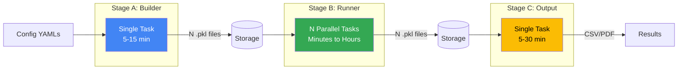

# Pipeline Stages

The pipeline orchestrates computational workloads through three sequential stages. Each stage serves a specific purpose in transforming experiment configurations into final results.

## Overview



- **Stage A (Builder)**: Reads YAML configs, builds EpiModel objects for each population, and generates N task input files
- **Stage B (Runner)**: Executes N simulations/calibrations in parallel
- **Stage C (Output)**: Aggregates results into formatted outputs

## Stage A: Builder

### Purpose

Reads experiment YAML configuration files, constructs model objects for each population, and packages them into self-contained task inputs that Stage B can execute in parallel.

### What It Does

**Input Files Read**:

- `basemodel.yaml` - Model structure (compartments, transitions, parameters, populations)
- `modelset.yaml` - Population definitions and scenario variants; contains calibration or sampling settings depending on workflow type (optional)
- `output.yaml` - Output generation settings (optional)

**Processing**:

1. Loads and validates YAML configuration files
2. Dispatches to the appropriate builder via `epymodelingsuite.dispatcher.dispatch_builder()` based on which configs are provided:
    - **Basemodel only** → builds a single EpiModel with simulation settings
    - **Basemodel + sampling config** → builds one EpiModel per parameter combination defined by the sampling strategy
    - **Basemodel + calibration config** → builds one ABCSampler per population, each containing the model, priors, observed data, and calibration strategy
3. Saves N input files to storage, one self-contained BuilderOutput per file

For example, if your calibration config defines 52 US state/territory populations, Stage A produces 52 input files (one per population). Each file contains everything needed to run the full calibration (including all particles) for that population.

**Output Files**:

```
builder-artifacts/
├── input_00000.pkl.gz
├── input_00001.pkl.gz
├── input_00002.pkl.gz
└── input_{N-1}.pkl.gz
```

Each `.pkl.gz` file is a gzip-compressed pickle containing a BuilderOutput: everything a single Stage B task needs to run: the constructed model, execution settings, and (for calibration) the sampler with priors and observed data.

### Execution Details

- **Concurrency**: Single task (1 container)
- **Typical Duration**: 5-15 minutes
- **Resources**: Low CPU, moderate memory (configuration parsing and object creation)
- **Entry Point**: `run_builder.sh` (wrapper that clones experiment repository), calling `main_builder.py`

### What Determines N?

The number of input files (N) depends on your configuration:

- **Calibration Mode**: N = number of populations. Each task runs the full calibration (all particles) for one population (e.g., 52 US states = 52 tasks)
- **Sampling Mode**: N = number of parameter combinations determined by the sampling strategy (grid, LHS, etc.)
- **Simple Simulation** (basemodel only): N = 1

The builder outputs `NUM_TASKS=N` as a job label, which Stage B uses to determine parallelism.

## Stage B: Runner

### Purpose

Executes simulations or calibrations in parallel. This is where the actual computational work happens.

### What It Does

**Input**: Single `.pkl.gz` file assigned to this task (`input_{TASK_INDEX}.pkl.gz`)

**Processing**:

1. Loads task configuration from assigned input file
2. Executes workload using `epymodelingsuite.dispatcher.dispatch_runner()` (simulation, calibration, or projection)
3. Serializes result to storage

**Output Files**:

```
runner-artifacts/
├── result_00000.pkl.gz
├── result_00001.pkl.gz
├── result_00002.pkl.gz
└── result_{N-1}.pkl.gz
```

Each result file contains simulation trajectories, fitted parameters, or projection outputs.

### Execution Details

- **Concurrency**: N parallel tasks (configurable max parallelism, default: 100)
- **Typical Duration**: Highly variable
    - Simple simulations: 5-30 minutes
    - Complex calibrations: 1-4 hours
    - Large-scale projections: 30 minutes - 2 hours
- **Resources**: High CPU, high memory (intensive computation)
- **Entry Point**: `main_runner.py`

### Task Assignment

Each container receives a unique task index. In cloud mode, Cloud Batch automatically sets `BATCH_TASK_INDEX` (0-indexed). In local mode, users set `TASK_INDEX` manually. The script checks both variables (`TASK_INDEX` takes precedence) and uses the index to load the corresponding input file.

### Independence & Parallelism

**Key Property**: Tasks are **completely independent** - no inter-task communication, can run in any order, and failures in one task don't affect others. This enables massive parallelism: cloud mode can scale to thousands of tasks, while local mode is limited by your machine's cores. Google Cloud Batch automatically schedules tasks across available VMs.

## Stage C: Output Generator

### Purpose

Aggregates results from all Stage B tasks and generates formatted outputs (tables, plots, formatted CSVs).

### What It Does

**Input**: All result files from Stage B (`result_00000.pkl.gz` through `result_{N-1}.pkl.gz`)

**Processing**:

1. Loads all result files
2. Auto-detects result type (simulation vs calibration vs projection)
3. Loads output configuration (auto-detects `output.yaml` or uses specified config)
4. Uses `epymodelingsuite.dispatcher.dispatch_output_generator()` to aggregate trajectories, compute quantiles, format for submission, and generate metadata
5. Saves to timestamped output directory

**Output Files** (varies by result type):

```
outputs/YYYYMMDD-HHMMSS/
├── quantiles_compartments.csv.gz           # Simulation
├── quantiles_transitions.csv.gz            # Simulation
├── quantiles_calibration.csv.gz            # Calibration
├── quantiles_projection_compartments.csv.gz  # Calibration
├── quantiles_projection_transitions.csv.gz   # Calibration
├── trajectories_compartments.csv.gz        # If requested
├── trajectories_transitions.csv.gz         # If requested
├── posteriors.csv.gz                       # Calibration only
├── model_metadata.csv.gz                   # If requested
└── output_hub_formatted.csv.gz             # If hub format requested
```

### Execution Details

- **Concurrency**: Single task (1 container)
- **Typical Duration**: 5-30 minutes (depends on N and output complexity)
- **Resources**: Moderate CPU, high memory (loading all N result files)
- **Entry Point**: `run_output.sh` (wrapper for optional repository cloning), calling `main_output.py`

### Timestamped Outputs

Output directories are timestamped in UTC (`YYYYMMDD-HHMMSS/`) to prevent overwriting. This allows running Stage C multiple times with different output configurations without losing previous results.

## Data flow between stages

For details on experiment data and artifacts that are saved in each stages, see **[Data and Artifacts](data-and-artifacts/index.md)**.

## Stage Orchestration

In cloud mode, Cloud Workflows automates the full Stage A → B → C sequence. In local mode, stages run sequentially via the `epycloud` CLI. See **[Execution Modes](execution-modes.md)** for the complete comparison.

## Next Steps

- **[Data and Artifacts](data-and-artifacts/index.md)**: Experiment data and artifact organization
- **[Running Experiments](../user-guide/running-experiments/index.md)**: How to run the pipeline (cloud and local)
- **[Docker Images](docker-images.md)**: How stages are containerized
- **[Storage Abstraction](storage-abstraction.md)**: How artifacts are stored
- **[Workflows Orchestration](workflows-orchestration.md)**: How stages are coordinated
- **[Monitoring](../user-guide/monitoring/index.md)**: How to monitor pipeline execution
- **[Troubleshooting](../user-guide/troubleshooting/index.md)**: Common issues and solutions
