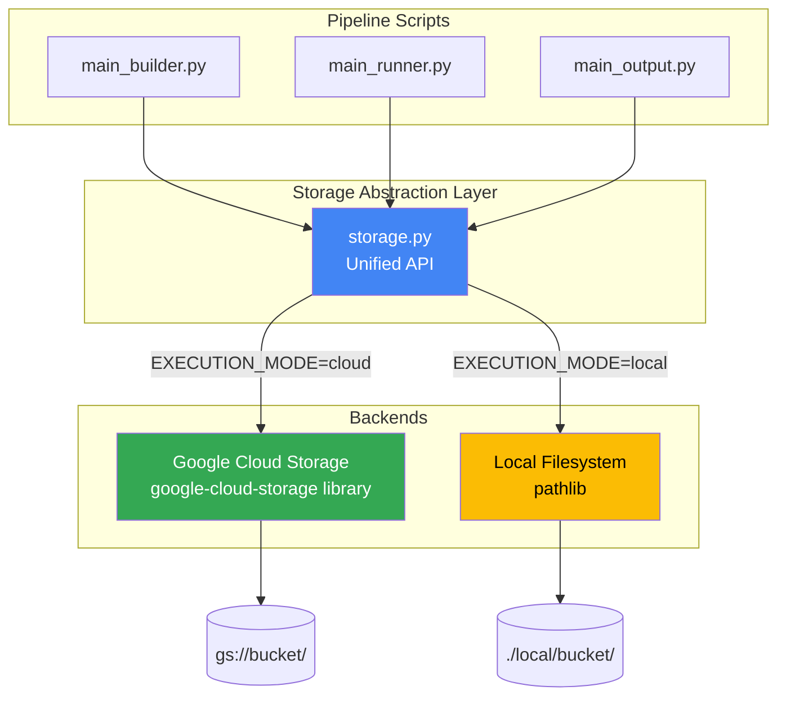

# Storage Abstraction

The pipeline uses a unified storage interface that works identically in both cloud and local execution modes. This abstraction is implemented in [`docker/scripts/util/storage.py`](https://github.com/mobs-lab/epymodelingsuite-cloud/blob/main/docker/scripts/util/storage.py).

## Why Storage Abstraction?

**Problem**: Pipeline scripts need to save and load artifacts, but the storage backend differs by mode:

- **Cloud mode**: Google Cloud Storage (GCS) with `gs://` URIs
- **Local mode**: Local filesystem with `./local/bucket/` paths

**Solution**: A unified API that automatically uses the correct backend based on the `EXECUTION_MODE` environment variable.

**Benefit**: Pipeline scripts (`main_builder.py`, `main_runner.py`, `main_output.py`) contain **zero mode-specific code**.

## Architecture



## Core Functions

| Function | Signature | Description |
|----------|-----------|-------------|
| `get_config()` | `() -> dict` | Returns storage configuration (mode, bucket, prefix, exp_id, run_id) based on environment variables |
| `get_path(*parts)` | `(*parts: str) -> str` | Constructs full storage path with correct format for current mode |
| `save_bytes(path, data)` | `(path: str, data: bytes) -> None` | Saves binary data to storage (GCS upload or filesystem write) |
| `load_bytes(path)` | `(path: str) -> bytes` | Loads binary data from storage (GCS download or filesystem read) |
| `list_files(prefix)` | `(prefix: str) -> list[str]` | Lists files matching a prefix (GCS blob listing or filesystem glob) |

All functions automatically dispatch to the correct backend based on `EXECUTION_MODE`:

| Function | Cloud Backend | Local Backend |
|----------|--------------|---------------|
| `save_bytes(path, data)` | GCS upload | Filesystem write |
| `load_bytes(path)` | GCS download | Filesystem read |
| `list_files(prefix)` | GCS blob listing | Filesystem glob |
| `get_path(*parts)` | `gs://bucket/prefix/...` | `./local/bucket/prefix/...` |

## Path Conventions

### Standard Directory Structure

All pipeline runs follow this structure:

```
{bucket}/
└── {dir_prefix}{exp_id}/
    └── {run_id}/
        ├── builder-artifacts/
        │   ├── input_0000.pkl
        │   ├── input_0001.pkl
        │   └── ...
        ├── runner-artifacts/
        │   ├── result_0000.pkl
        │   ├── result_0001.pkl
        │   └── ...
        └── outputs/
            └── {timestamp}/
                ├── quantiles.csv.gz
                ├── trajectories.csv.gz
                └── ...
```

### Path Components

- **Bucket**: GCS bucket (`gs://my-bucket`) in cloud mode, local directory (`./local/bucket`) in local mode
- **DIR_PREFIX**: Base directory prefix (default: `pipeline/flu/`), configurable per profile
- **EXP_ID**: Experiment identifier from user (e.g., `202550/smc_rmse_202543-202549`), can include subdirectories
- **RUN_ID**: Unique run identifier (`YYYYMMDD-HHMMSS-{uuid-prefix}`), auto-generated in cloud mode

### File Naming Conventions

- **Input files**: `input_{index:04d}.pkl` (e.g., `input_0000.pkl`, `input_0042.pkl`)
- **Result files**: `result_{index:04d}.pkl` (e.g., `result_0000.pkl`, `result_0042.pkl`)
- **Output files**: `quantiles.csv.gz`, `trajectories.csv.gz`, `metadata.json`, etc. in a timestamped subdirectory

## Next Steps

- **[Execution Modes](execution-modes.md)**: How cloud and local modes use the storage abstraction
- **[Pipeline Stages](pipeline-stages.md)**: How stages use storage
- **[Docker Images](docker-images.md)**: Where the storage module lives in the Docker image
- **[Cloud Infrastructure](cloud-infrastructure.md)**: GCS bucket configuration
