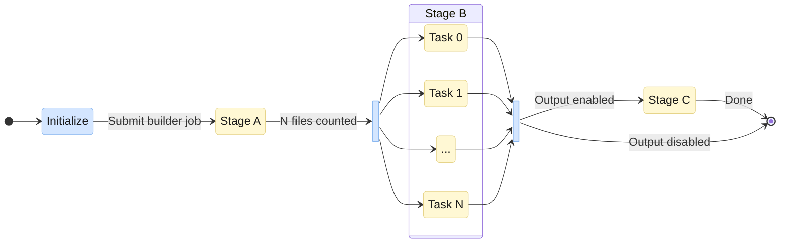

# Workflows Orchestration

Cloud Workflows coordinates the execution of all three pipeline stages (Builder, Runner, Output) in a single automated workflow. It handles job submission, status polling, and error handling.

<!-- link-card: https://docs.cloud.google.com/workflows/docs/overview
    | title="Workflows overview | Google Cloud"
-->

## Overview

Users trigger a workflow by running `epycloud run workflow --exp-id <experiment>`. The workflow moves sequentially through **initialization**, **[three pipeline stages](pipeline-stages.md)**, and **completion**. Each stage is submitted as a Cloud Batch job and polled until done.

Stage A reads experiment configs and produces N input files, one per location. Stage B is [embarrassingly parallel](https://en.wikipedia.org/wiki/Embarrassingly_parallel): each task runs a simulation or calibration for one location independently, with no communication between tasks. Cloud Batch automatically provisions VMs and schedules tasks across them. Stage C starts only after all Stage B tasks complete, since it aggregates results across all locations to produce output files.

All inter-stage artifacts and final outputs gets stored in Cloud Storage bucket.

<small>
 Cloud Batch job &nbsp;&nbsp;
 Workflow control
</small>

## Steps

### Initialize

- Generate unique `RUN_ID` from timestamp and execution ID
- Build GCS paths (`{dir_prefix}{exp_id}/{run_id}/`)
- Configure stage resources (CPU, memory, machine type)

### Stage A (Builder)

- Submit Batch job with 1 task
- Reads experiment YAML configs, builds EpiModel objects (one per location), and packages each into a self-contained BuilderOutput
- Saves N input files to `builder-artifacts/input_*.pkl.gz` (one per location/task)
- Poll Batch API for job status until complete
- Count files in GCS to determine N (number of parallel tasks)

### Stage B (Runner)

- Submit Batch job with N tasks (parallelism capped at `maxParallelism`)
- Each task loads one BuilderOutput, runs the simulation or calibration, and saves a SimulationOutput or CalibrationOutput to `runner-artifacts/result_*.pkl.gz`
- Poll Batch API for job status until complete

### Stage C (Output, conditional)

- Skipped if `RUN_OUTPUT_STAGE=false`
- Submit Batch job with 1 task, passing `NUM_TASKS=N`
- Loads all N result files, aggregates trajectories across locations, computes quantiles, and generates formatted CSV/plots to `outputs/YYYYMMDD-HHMMSS/`
- Poll Batch API for job status until complete

### Complete

- Return job names and N

For details on artifacts produced by each stage, see **[Pipeline Artifacts](data-and-artifacts/pipeline-artifacts.md)**.

The workflow definition lives in [`terraform/workflow.yaml`](https://github.com/mobs-lab/epymodelingsuite-cloud/blob/main/terraform/workflow.yaml) and is deployed via Terraform.

## Workflow Template and Variables

The workflow YAML is a Terraform template. Values like `${image_tag}` and `${stage_b_cpu_milli}` are substituted by Terraform at deploy time, while `$${}` expressions are evaluated by Cloud Workflows at runtime.

Variables come from two sources:

1. **Terraform variables** (set at deploy time): Baked into the workflow definition as defaults for stage resources, network config, and image settings
2. **Runtime input from epycloud** (set at execution time): When a user runs `epycloud run workflow`, the CLI builds a JSON argument (`bucket`, `dirPrefix`, `exp_id`, `batchSaEmail`, `imageTag`, machine type overrides, etc.) and passes it as the `input` parameter to the workflow execution via the REST API

The workflow merges these two sources, with runtime overrides taking precedence.

### Workflow Variables

The workflow sets up a large number of variables during initialization:

- **RUN_ID**: Generated as `YYYYMMDD-HHMMSS-{uuid-prefix}` (e.g., `20251210-143052-a1b2c3d4`). The timestamp provides human readability, while the UUID prefix (first 8 characters of the execution ID) ensures uniqueness. Passed to all three stages.
- **GCS paths**: Built from `{dir_prefix}{exp_id}/{run_id}/`, with each stage writing to its own subdirectory (`builder-artifacts/`, `runner-artifacts/`, `outputs/`)
- **Image URI**: Constructed from project, region, repo name, and image tag
- **Stage resources**: Per-stage `cpuMilli`, `memoryMib`, `machineType`, and `maxRunDuration`. Defaults come from Terraform variables but can all be overridden at runtime. C4D machine types receive special handling, requiring Hyperdisk boot disks instead of standard persistent disks.
- **Network and service account**: VPC subnet and Batch service account email
- **exp_id label**: Sanitized by replacing `/` with `-` for GCP label compliance

### Container Environment Variables

When submitting each Batch job, the workflow passes environment variables to the container so each stage knows where to read inputs and write outputs:

- `EXECUTION_MODE`, `GCS_BUCKET`, `DIR_PREFIX`, `EXP_ID`, `RUN_ID` (all stages)
- `GITHUB_FORECAST_REPO`, `FORECAST_REPO_REF`, `GITHUB_PAT_SECRET` (for cloning experiment configs)
- `NUM_TASKS` (Stage C only, set from the file count)
- `OUTPUT_CONFIG_FILE` (Stage C only, optional)

For the full list of environment variables, see **[Docker Images: Environment Variables](docker-images.md#environment-variables)**.

## Batch Job Submission

Each stage is submitted as a Cloud Batch job via the Batch REST API.

### Job Properties

- **Naming**: Jobs are named `stage-a-{uniqueId}`, `stage-b-{uniqueId}`, `stage-c-{uniqueId}`
- **Labels**: Every job is labeled with `component`, `project`, `environment`, `stage`, `exp_id`, `run_id`, and `managed-by: workflows` for tracking and filtering
- **Service account**: Jobs run under a dedicated Batch service account
- **Networking**: VMs run in a configured VPC subnet with no external IP addresses
- **Logging**: All jobs log to Cloud Logging (`logsPolicy: CLOUD_LOGGING`)

### Parallelism

Stage B parallelism is calculated as `min(N, maxParallelism)`, where `maxParallelism` defaults to 100. The `taskCountPerNode` setting controls how many tasks share a single VM (default: 1 task per VM). With 1 task per VM, each task gets the full machine's CPU and memory, avoiding resource contention between tasks.

### Optional Output Stage

Stage C (output generation) is optional, controlled by the `RUN_OUTPUT_STAGE` parameter (default: `true`). Users can skip it with `epycloud run workflow --exp-id <experiment> --skip-output`. This is useful for testing, or when you want to run output generation separately with different configurations.

## Subworkflows

### waitJob

All stages share the same `waitJob` subworkflow, which polls the Batch API for job status every 15 seconds for up to 3000 iterations (~12.5 hours max). It checks for `SUCCEEDED`, `FAILED`, or `DELETION_IN_PROGRESS` states. Transient API errors are caught and retried after a 10-second delay. Individual stage durations are bounded by their `maxRunDuration` setting.

### waitForFiles

After Stage A completes, the workflow calls `waitForFiles` to poll GCS for builder artifacts (up to 60 retries, 5 seconds apart). This handles the delay between Stage A finishing and files becoming visible in GCS. Once files are found, the workflow counts them to determine N and validates that N > 0 before proceeding.

## Error Handling

- **Job failures**: If a Batch job fails (any task returns non-zero exit code), the workflow raises an error and the execution is marked as `FAILED`. The error message includes the job name for debugging.
- **Timeout**: If polling exceeds max retries, the workflow raises a timeout error. Recovery options include increasing the retry count or `maxRunDuration` for slow stages.
- **API errors**: Transient API errors (network issues, rate limits) are retried after a 10-second delay within the polling loop.

## Next Steps

- **[Running Experiments](../user-guide/running-experiments/index.md)**: How to submit and manage experiments
- **[Monitoring Workflows](../user-guide/monitoring/workflows.md)**: How to monitor workflow execution
- **[Cloud Infrastructure](cloud-infrastructure.md)**: Google Cloud resources used by workflows
- **[Pipeline Stages](pipeline-stages.md)**: What workflows orchestrate
